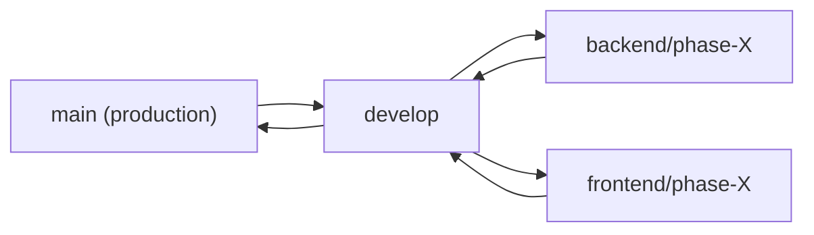

# 🗺️ Lộ Trình — WordPress WooCommerce Store
## 2 Người | 4 Phase | Phối Hợp Qua GitHub

---

## 👥 Phân Vai Trò

| | **Dev A — Backend / Server** | **Dev B — Frontend / Design** |
|---|---|---|
| **Chuyên môn** | WordPress core, WooCommerce, plugin, server, DB | Elementor, WoodMart, UI/UX, responsive, content |
| **Branch** | `backend/phase-X-task` | `frontend/phase-X-task` |
| **DB** | ✅ **Source of truth** — quản lý DB staging | ❌ Chỉ import DB từ Dev A, không push DB |

---

## 📋 PHASE 1 — WordPress Foundation

### Dev A — Backend

- [ ] Cài WordPress trên hosting/server
- [ ] Cấu hình permalink, timezone, ngôn ngữ
- [ ] Cài theme WoodMart + tạo child theme
- [ ] Cài plugin cần thiết ban đầu:

| Plugin | Mục đích |
|---|---|
| WoodMart Core | Theme core |
| Elementor / Elementor Pro | Page builder |
| WooCommerce | E-commerce |
| Yoast SEO / RankMath | SEO |
| WP Fastest Cache / LiteSpeed | Cache |
| UpdraftPlus | Backup |
| Wordfence | Security |
| WP Mail SMTP | Email |
| Contact Form 7 / WPForms | Form |

- [ ] Tạo user role cơ bản (Admin, Editor, Shop Manager, Customer)
- [ ] Cấu hình quyền cho từng role
- [ ] Setup backup/restore (UpdraftPlus)
- [ ] Test backup + restore thử 1 lần
- [ ] Export DB dump → push vào `database-exports/`

### Dev B — Frontend

- [ ] Tạo GitHub repo, `.gitignore`, README
- [ ] Setup local environment (LocalWP / Docker)
- [ ] Tạo các trang cơ bản: Home, About, Contact, Policy, Terms
- [ ] Tạo menu chính (Header navigation)
- [ ] Tạo menu Footer
- [ ] Tạo Header layout (WoodMart Header Builder)
- [ ] Tạo Footer layout

### ✅ Merge checkpoint
- [ ] Cả 2 tạo PR → cross-review → merge vào `develop`
- [ ] Dev A export DB dump mới nhất

---

## 📋 PHASE 2 — Elementor / Giao Diện

### Dev A — Backend

> [!NOTE]
> Dev A chạy trước một phần Phase 3 để tận dụng thời gian trong lúc Dev B build UI.

- [ ] Cài và cấu hình WooCommerce *(Phase 3 — làm trước)*
- [ ] Cấu hình tiền tệ, địa chỉ shop *(Phase 3 — làm trước)*
- [ ] Tạo trang Shop, Cart, Checkout, My Account *(Phase 3 — làm trước)*
- [ ] Tạo category sản phẩm *(Phase 3 — làm trước)*
- [ ] Tạo 1-2 sản phẩm mẫu để Dev B test layout *(Phase 3 — làm trước)*
- [ ] Review frontend trên các trình duyệt (hỗ trợ Dev B)
- [ ] Export DB dump → push vào `database-exports/`

### Dev B — Frontend

- [ ] Làm Homepage bằng Elementor/WoodMart
- [ ] Tạo landing page mẫu
- [ ] Tạo block: Hero section
- [ ] Tạo block: Features section
- [ ] Tạo block: Pricing section
- [ ] Tạo block: FAQ section
- [ ] Tạo block: CTA section
- [ ] Save các blocks thành Elementor templates
- [ ] Tối ưu giao diện Header (responsive)
- [ ] Tối ưu giao diện Footer (responsive)
- [ ] Chỉnh responsive Homepage — Desktop
- [ ] Chỉnh responsive Homepage — Tablet
- [ ] Chỉnh responsive Homepage — Mobile
- [ ] Chỉnh responsive Landing Page
- [ ] Test giao diện mobile (thực tế trên điện thoại)
- [ ] Fix bugs responsive

### ✅ Merge checkpoint
- [ ] Cả 2 tạo PR → cross-review → merge vào `develop`
- [ ] Dev A export DB dump mới nhất

---

## 📋 PHASE 3 — WooCommerce Core

### Dev A — Backend

> [!NOTE]
> Một số task đã hoàn thành song song trong Phase 2. Dưới đây là phần còn lại.

- [ ] Tạo sản phẩm đơn giản (đầy đủ)
- [ ] Tạo sản phẩm biến thể (variable product)
- [ ] Setup attributes + variations
- [ ] Tạo sản phẩm digital/download
- [ ] Upload file downloadable, setup access
- [ ] Tạo sản phẩm service/setup
- [ ] Tạo form thu thập yêu cầu (cho service product)
- [ ] Tạo coupon giảm giá
- [ ] Setup payment gateway (sandbox)
- [ ] Test full flow mua hàng — sản phẩm đơn giản
- [ ] Test full flow mua hàng — sản phẩm biến thể
- [ ] Test full flow mua hàng — sản phẩm digital
- [ ] Test full flow mua hàng — service product
- [ ] Test coupon, tax, shipping (nếu có)
- [ ] Export DB dump → push vào `database-exports/`

### Dev B — Frontend

- [ ] Customize trang Shop (layout, filter)
- [ ] Customize trang single product
- [ ] Customize trang Cart
- [ ] Customize trang Checkout
- [ ] Customize trang My Account
- [ ] Style email templates WooCommerce
- [ ] Chỉnh responsive trang Shop
- [ ] Chỉnh responsive trang Cart/Checkout
- [ ] Test UX flow mua hàng trên mobile
- [ ] Review UI tất cả trang WooCommerce
- [ ] Fix UI bugs

### ✅ Merge checkpoint
- [ ] Cả 2 tạo PR → cross-review → merge vào `develop`
- [ ] Dev A export DB dump mới nhất

---

## 📋 PHASE 4 — Digital Product / Workflow Store

### Dev A — Backend

- [ ] Tạo sản phẩm n8n workflow mẫu + upload file .json
- [ ] Tạo sản phẩm automation setup service + setup form intake
- [ ] Tạo sản phẩm AI agent package + setup deliverables/file download
- [ ] Tạo gói monthly support (subscription nếu có)
- [ ] Cấu hình recurring payment (nếu dùng subscription)
- [ ] Thêm chính sách refund/support + tạo trang Refund Policy
- [ ] Test download file sau khi mua (tất cả sản phẩm digital)
- [ ] Test form thu thập yêu cầu setup
- [ ] Final test: mua thử tất cả loại sản phẩm
- [ ] Check download links, email notifications
- [ ] Full backup trước launch
- [ ] Merge final vào `main`
- [ ] 🚀 Deploy to production

### Dev B — Frontend

- [ ] Viết mô tả sản phẩm n8n workflow (chuẩn bán hàng)
- [ ] Viết mô tả automation setup service
- [ ] Viết mô tả AI agent package
- [ ] Viết mô tả monthly support
- [ ] Tạo hình ảnh/thumbnail cho từng sản phẩm
- [ ] Thêm FAQ cho sản phẩm n8n workflow
- [ ] Thêm FAQ cho automation setup service
- [ ] Thêm FAQ cho AI agent package
- [ ] Thêm FAQ cho monthly support
- [ ] Review tất cả mô tả sản phẩm
- [ ] Test UX toàn bộ store trên mobile
- [ ] Test email sau khi mua hàng
- [ ] Final review UI/UX toàn site
- [ ] Check responsive tất cả trang
- [ ] Performance check (PageSpeed, GTmetrix)
- [ ] SEO check (meta, sitemap, robots.txt)
- [ ] 🚀 Final sign-off

### ✅ Merge checkpoint
- [ ] Merge final vào `main` → deploy

---

## 🔀 GitHub Workflow



| Quy tắc | Chi tiết |
|---|---|
| **Branch naming** | `backend/phase-1-task-name` hoặc `frontend/phase-2-task-name` |
| **Commit message** | `[Phase X] Mô tả ngắn` — VD: `[Phase 1] Setup WordPress + cấu hình cơ bản` |
| **Pull Request** | Mỗi task xong → tạo PR vào `develop`, tag người kia review |
| **Merge** | Chỉ merge sau khi có ít nhất 1 approval |
| **Sync** | Mỗi sáng trước khi làm: `git pull origin develop` |

### .gitignore

```gitignore
# WordPress core
wp-admin/
wp-includes/
wp-*.php
index.php
license.txt
readme.html

# Config
wp-config.php

# Uploads
wp-content/uploads/

# Plugins (chỉ track custom)
wp-content/plugins/*
!wp-content/plugins/custom-*/

# Theme (chỉ track child theme)
wp-content/themes/*
!wp-content/themes/woodmart-child/

# Cache
wp-content/cache/

# OS
.DS_Store
Thumbs.db
```

---

## 🗄️ Quy Ước Database — Dev A Là Source of Truth

| Quy tắc | Chi tiết |
|---|---|
| **Source of truth** | **Dev A quản lý DB trên staging server** — mọi thay đổi DB chính thức đều qua Dev A |
| **Dev B** | Làm trên local → chỉ push **file code** qua Git, **không push DB** |
| **Content/Settings** | Dev B cần thay đổi WP Admin → báo Dev A thực hiện trên staging, hoặc Dev B làm local rồi Dev A replicate |
| **DB Export** | Dev A export SQL dump cuối mỗi phase (hoặc mỗi ngày) → commit vào `database-exports/` |

**Quy trình sync DB cho Dev B:**
```
1. Dev A export DB → push vào repo (database-exports/latest.sql)
2. Dev B pull repo → import latest.sql vào local
3. Dev B dùng WP Migrate DB để đổi URL (staging → localhost)
4. Dev B làm việc trên local → chỉ commit file code
5. Nếu Dev B tạo content mới (Elementor template, page) → báo Dev A
6. Dev A replicate trên staging → export DB mới
```

> [!WARNING]
> **Dev B KHÔNG BAO GIỜ overwrite DB trên staging.** Mọi thay đổi DB phải đi qua Dev A.

---

## ⚠️ Quy Tắc Tránh Conflict

| Nguyên tắc | Chi tiết |
|---|---|
| **Phân vùng rõ ràng** | Dev A không chỉnh CSS/template, Dev B không chỉnh backend logic |
| **Không edit cùng file** | Nếu cần edit cùng file → báo nhau trước |
| **Commit nhỏ, thường xuyên** | Mỗi task nhỏ = 1 commit |
| **Merge sớm** | PR không nên tồn tại quá 1 ngày |
